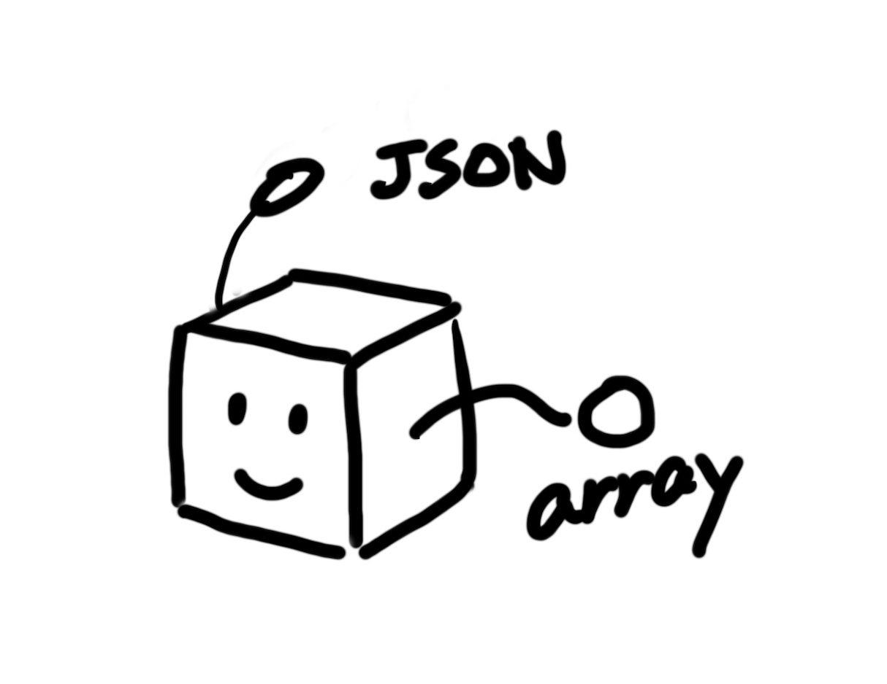

# JSON-Schema-Connected
[](https://github.com/koriym/json-schema-to-array-shape/actions/workflows/nodejs.yml)



This project provides a set of utilities for working with JSON Schemas. It includes three main libraries:

1. Array Shape Generator
2. SQL Schema Generator
3. Markdown Documentation Generator

These utilities help you generate sample data, create SQL tables, and produce documentation from your JSON Schemas.

## Table of Contents

- [Installation](#installation)
- [Usage](#usage)
    - [Array Shape Generator](#array-shape-generator)
    - [SQL Schema Generator](#sql-schema-generator)
    - [Markdown Documentation Generator](#markdown-documentation-generator)
- [API Reference](#api-reference)
- [Examples](#examples)
- [JSON Schema-Centric Data Modeling](#json-schema-centric-data-modeling)
    - [Benefits](#benefits)
    - [Background](#background)
    - [Design Philosophy](#design-philosophy)
- [Contributing](#contributing)
- [License](#license)

## Installation

To use these utilities, clone this repository and install the dependencies:

```bash
git clone https://github.com/koriym/json-schema-connected.git
cd json-schema-connected
npm install
```

## Usage

### Array Shape Generator

The Array Shape Generator creates a sample array based on your JSON Schema.

```javascript
const { jsonSchemasToArrayShape } = require('./schema-array-shape');

const schema = {
  type: 'object',
  properties: {
    id: { type: 'integer' },
    name: { type: 'string' }
  }
};

const arrayShape = jsonSchemasToArrayShape(schema);
console.log(arrayShape);
```

### SQL Schema Generator

The SQL Schema Generator creates SQL `CREATE TABLE` statements from your JSON Schema.

```javascript
const { jsonSchemaToCreateTable, convertJsonSchemasToCreateTables } = require('./schema-sql');

// For a single schema
const singleSchema = { /* your JSON schema here */ };
const sqlStatement = jsonSchemaToCreateTable(singleSchema, 'tableName');
console.log(sqlStatement);

// For multiple schemas
const multipleSchemas = [ /* array of JSON schemas */ ];
const allSql = convertJsonSchemasToCreateTables(JSON.stringify(multipleSchemas));
console.log(allSql);
```

### Markdown Documentation Generator

The Markdown Documentation Generator creates readable documentation from your JSON Schema.

```javascript
const { jsonSchemaToMarkdown, convertJsonSchemasToMarkdowns } = require('./schema-markdown');

// For a single schema
const singleSchema = { /* your JSON schema here */ };
const markdown = jsonSchemaToMarkdown(singleSchema, __dirname);
console.log(markdown);

// For multiple schemas
const multipleSchemas = [ /* array of JSON schemas */ ];
const fullMarkdown = convertJsonSchemasToMarkdowns(multipleSchemas, __dirname);
console.log(fullMarkdown);
```
## Examples

Here are some practical examples demonstrating how to use the JSON Schema Utilities in various scenarios:

### 1. Basic Usage

This example shows how to use all three utilities with a simple JSON Schema:

```javascript
const fs = require('fs');
const { jsonSchemasToArrayShape } = require('./schema-array-shape');
const { jsonSchemaToCreateTable } = require('./schema-sql');
const { jsonSchemaToMarkdown } = require('./schema-markdown');

// Define a simple JSON Schema
const schema = {
  "$schema": "http://json-schema.org/draft-07/schema#",
  "title": "Person",
  "type": "object",
  "properties": {
    "name": {
      "type": "string",
      "description": "The person's full name"
    },
    "age": {
      "type": "integer",
      "description": "Age in years",
      "minimum": 0
    },
    "email": {
      "type": "string",
      "format": "email",
      "description": "Email address"
    }
  },
  "required": ["name", "age"]
};

// Generate array shape
console.log("Array Shape:");
console.log(JSON.stringify(jsonSchemasToArrayShape(schema), null, 2));

// Generate SQL
console.log("\nSQL Create Table Statement:");
console.log(jsonSchemaToCreateTable(schema, "person"));

// Generate Markdown
console.log("\nMarkdown Documentation:");
console.log(jsonSchemaToMarkdown(schema, __dirname));
```

### 2. Integrating with a Web Application

This example shows how you might integrate these utilities into a simple Express.js web application:

```javascript
const express = require('express');
const { jsonSchemasToArrayShape } = require('./schema-array-shape');
const { jsonSchemaToCreateTable } = require('./schema-sql');
const { jsonSchemaToMarkdown } = require('./schema-markdown');

const app = express();
app.use(express.json());

app.post('/generate', (req, res) => {
  const schema = req.body;
  
  const arrayShape = jsonSchemasToArrayShape(schema);
  const sqlStatement = jsonSchemaToCreateTable(schema, 'generated_table');
  const markdown = jsonSchemaToMarkdown(schema, __dirname);

  res.json({
    arrayShape,
    sqlStatement,
    markdown
  });
});

const PORT = process.env.PORT || 3000;
app.listen(PORT, () => console.log(`Server running on port ${PORT}`));
```

These examples demonstrate various ways to use the JSON Schema Utilities in different contexts, from basic usage to integration in a web application. They provide a starting point for users to understand how to incorporate these tools into their own projects.

## JSON Schema-Centric Data Modeling

### Benefits

Data modeling centered around JSON Schema offers several significant advantages:

1. **Language-Agnostic**: JSON Schema is independent of any programming language, making it ideal for cross-platform and multi-language projects.

2. **Self-Documenting**: JSON Schema provides a clear, readable description of your data structure, serving as both specification and documentation.

3. **Validation**: JSON Schema allows for automatic validation of data, ensuring data integrity across your application.

4. **Tooling Support**: Many tools and libraries support JSON Schema, allowing for code generation, data mocking, and more.

5. **Flexibility**: JSON Schema can describe simple to complex data structures, accommodating a wide range of use cases.

6. **Interoperability**: JSON Schema facilitates easy data exchange between different systems and services.

7. **Version Control Friendly**: Being text-based, JSON Schema works well with version control systems, making it easy to track changes in your data model over time.

### Background

JSON Schema emerged as a response to the growing popularity of JSON (JavaScript Object Notation) as a data interchange format. While JSON itself is lightweight and easy to read, it lacks a built-in way to describe the structure of data or enforce constraints.

JSON Schema was introduced to address these limitations. It provides a vocabulary to annotate and validate JSON documents, offering a contract for what JSON data should look like. This concept has roots in XML Schema and other data description formats, but it's designed to be more lightweight and JSON-centric.

### Design Philosophy

The design philosophy behind JSON Schema-centric data modeling emphasizes several key principles:

1. **Separation of Concerns**: By defining data structure separately from code, we achieve a clear separation between data modeling and application logic.

2. **Single Source of Truth**: The JSON Schema becomes the authoritative definition of your data model, reducing inconsistencies across different parts of your system.

3. **Design-First Approach**: Encouraging developers to think about and define their data structures before implementation leads to more thoughtful and robust system designs.

4. **Extensibility**: JSON Schema is designed to be extensible, allowing for custom vocabularies and extensions to meet specific needs.

5. **Human and Machine Readable**: The format strikes a balance between being easily understood by humans and efficiently processed by machines.

6. **Reusability**: Schemas can be shared and reused across different parts of an application or even between different applications, promoting consistency and reducing duplication.

By centering your data modeling around JSON Schema and leveraging tools like those provided in this project, you can create more maintainable, consistent, and well-documented data models for your applications.

## Contributing

Contributions are welcome! Please feel free to submit a Pull Request.

## License

This project is licensed under the MIT License.
